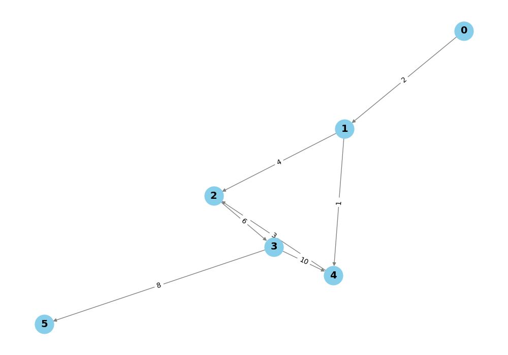

# Graph Analysis Project

## Project Overview

This project is a Python implementation for analyzing directed graphs. It includes functionalities like detecting cycles, calculating metrics for different node classifications (source, intermediate, and sink nodes), finding the shortest paths based on weights and complexities, and visualizing the graph.

The program allows you to either use a predefined complex graph or manually input the edges, weights, and complexities for a custom graph.

## Installation Instructions

1. **Clone the Repository**:
   ```bash
   git clone <https://github.com/QnarikP/Graph-Analysis.git>
   cd graph-analysis
   ```

2. **Install Dependencies**:
   ```bash
   pip install -r requirements.txt
   ```

## Usage Guide

1. Run the main script:
   ```bash
   python main.py
   ```

2. You will be prompted to choose whether to use the default complex graph or manually enter a graph:
   - Enter `y` to use the default graph.
   - Enter `n` to input your own graph edges, weights, and complexities interactively.

3. View the graph visualization in a pop-up window or find the saved graph image `graph.png` in the project directory.

4. The program will display the calculated metrics for source, intermediate, and sink nodes, detect any cycles in the graph, and find the shortest paths between source and sink nodes.

## Code Structure

- **`main.py`**: Main script to run the program. Handles user input for graph selection, initiates the graph analysis, and triggers visualization.
- **`graph.py`**: Contains the `Graph` class with methods for node classification, adjacency matrix creation, reachability computation, shortest path finding, and cycle detection.
- **`utils.py`**: Utility functions for handling user input and displaying output like paths and cycle information.
- **`visualization.py`**: Functions for visualizing the graph using `matplotlib` and saving the graph as an image.

## Visualization Examples



This image shows a sample visualization of the graph with nodes and edges, including edge weights. The image is generated and saved automatically after running the program.
```
